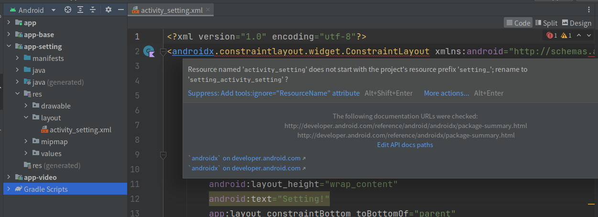
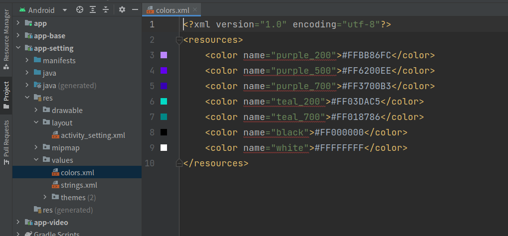

# 资源文件命名规范

## 一、概述

在Android的多模块开发中，资源文件的命名是一个很重要的问题，如果命名不规范，就会导致资源文件的覆盖，从而导致资源文件的错误。

例如我们有两个模块，分别是`app-setting`和`app-video`，这两个模块都有一个`activity_main.xml`文件，那么这两个文件就会发生冲突，导致其中一个模块的`activity_main.xml`文件被覆盖，从而导致这个模块的功能异常。

其实，如果存在多个模块有相同的资源文件，那么在编译的时候，后面的模块的资源文件会覆盖前面的模块的资源文件，所以我们在命名资源文件的时候，需要遵循一定的规范，以避免资源文件的冲突。

## 二、解决方案

### 2.1 资源文件的命名规范

在开发过程中，资源标识是不能随意替换的，否则将会导致功能异常。因此在开发过程中，给资源命名是，一定要遵循一定的规范，如下：

资源文件的命名规则：`模块名_资源类型_资源名称`，例如`app_setting_activity_main.xml`，其中`app_setting`是模块名，`activity_main`是资源名称，`xml`是资源类型。

### 2.2 统一解决方案

针对不同的模块，我们只需要在`build.gradle`文件中`android`节点下添加`resourcePrefix`配置，就可以要求资源文件名、资源键名的需要使用指定的前缀，如在`app-setting`模块中添加如下代码：

```groovy
apply from: '../app.gradle'

android {
    namespace 'cn.jkdev.setting'
    resourcePrefix 'setting_'

    defaultConfig {
        if (!isRelease) {
            applicationId "cn.jkdev.setting"
            versionCode 1
            versionName "1.0"
        }
    }
}

dependencies {
}
```

修改后同步gradle，然后在`res`目录下创建一个`layout`目录，可以看到不以`setting_`开头的资源文件都会出现红色告警，如下：



同时相关的资源键名也会出现红色告警，如下：



## 三、总结

在上诉提供的解决方案中，我们只需要在`build.gradle`文件中`android`节点下添加`resourcePrefix`配置，就可以要求资源文件名、资源键名的需要使用指定的前缀，这样就可以避免资源文件的冲突。

不过，当我们添加了`resourcePrefix`配置后，即使我们在`res`目录下的资源文件名、资源键名不以`resourcePrefix`指定的字符串开头，编译也不会报错，只是会有一个警告。
