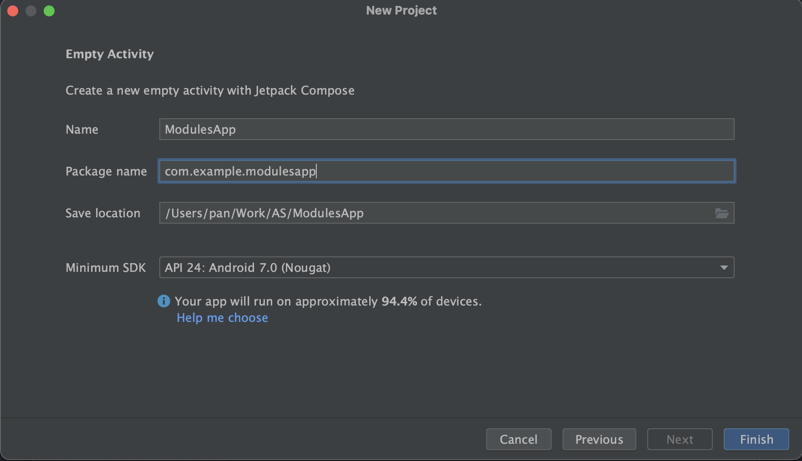
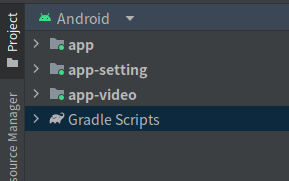
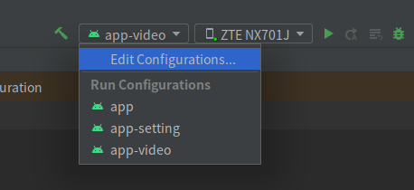
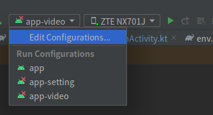

# 模块独立与组合

## 一、创建应用

我们先新建一个Empty项目，改项目也是主模块，项目基本信息如下



- 应用名称: `modules`
- 包名: `cn.jkdev.modules`

## 二、创建多个子模块

我们通过建立多个模块的方式来实现应用的独立与组合。

### 2.1 设置模块

- 模块名称：`app-setting`
- 包名：`cn.jkdev.modules.settings`
- 首页：`SettingsActivity`

### 2.2 视频模块

- 模块名称：`app-video`
- 包名：`cn.jkdev.modules.video`
- 首页：`VideoActivity`

### 2.3 结构

完成以上步骤后，我们得到如下的`Android`项目结构



同时在构建与运行按钮上，我们可以看到，我们的应用已经被分成了三个模块，如下图



这三个模块分别是`app`、`app-setting`、`app-video`，他们都是可以独立运行的APP，可以对他们进行单独的调试。

## 三、模块独立与组合

### 3.1 将模块类型进行切换

#### 3.1.1 如何区分模块类型

在Android中，如何将一个模块定义为APP还是Library，是通过`build.gradle`文件中的`plugins`来进行指定的。在kotlin语言的`build.gradle`文件中，如果是模块是APP类型，定义内容将如下

```groovy
plugins {
    id 'com.android.application'
    id 'org.jetbrains.kotlin.android'
}
```

如果是Library类型，定义内容将如下

```groovy
plugins {
    id 'com.android.library'
    id 'org.jetbrains.kotlin.android'
}
```

#### 3.1.2 定义全局的gradle文件

因此，在多模块的情况下，我们可以通过修改`build.gradle`文件中的`plugins`来实现模块的独立与组合。为了方便，我们需要创建一个全局的gradle 文件，这个文件将包含所有模块的公共配置，然后在每个模块的`build.gradle`文件中，通过`apply from`的方式来引用这个全局的`build.gradle`文件，这样就可以实现公共配置的统一管理。在这里，我们在项目根目录下创建一个`env.gradle`文件，来定义公共的配置内容，如下

```groovy
ext {
    isRelease = false
}
```

然后我们在各个子模块之中，通过`apply from`的方式来引用这个全局的`env.gradle`文件，将模块gradle的头部改为如下

```groovy
apply from: '../app.gradle'

plugins.apply('org.jetbrains.kotlin.android')
if (isRelease) {
    plugins.apply('com.android.library')
} else {
    plugins.apply('com.android.application')
}
```

此时，如果我们把公共配置文件中的`isRelease`改为`true`，那么所有的子模块都将变成Library类型；如果我们把公共配置文件中的`isRelease`改为`false`，那么所有的模块都将变成APP类型。当子模块是Library类型时，他们将不会出现在构建与运行按钮上，也就是说，他们将不会被单独运行，只能作为其他模块的依赖。如下图



同时，我们需要在APP主模块的`build.gradle`文件中的`dependencies`节点引用各个子模块，如下

```groovy
if (isRelease) {
    implementation project(':app-video')
    implementation project(':app-setting')
}
```

### 3.2 创建主界面

根据第二步，我们已经创建了三个模块，他们都是可以独立运行的APP，但是我们的应用还需要一个主界面，这个主界面需要包含`app-setting`和`app-video`两个模块的入口，这样才能实现应用的独立与组合。
